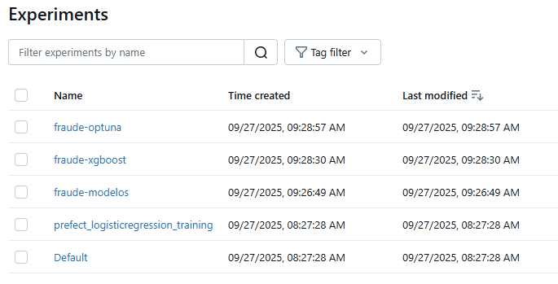
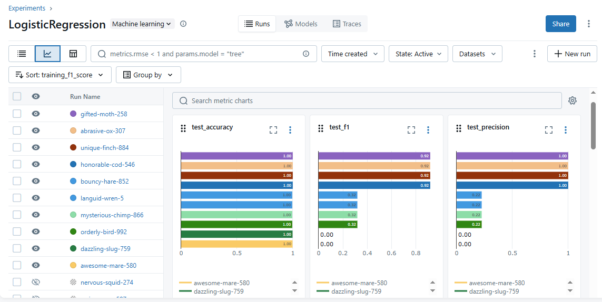
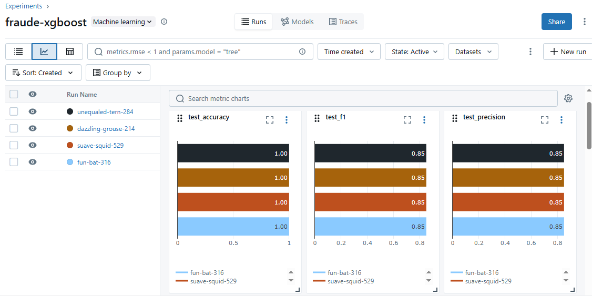
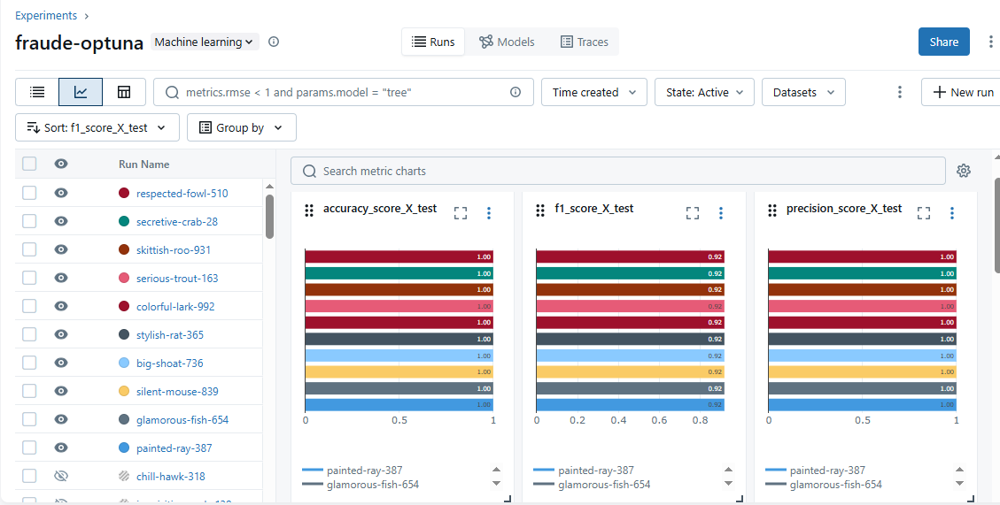
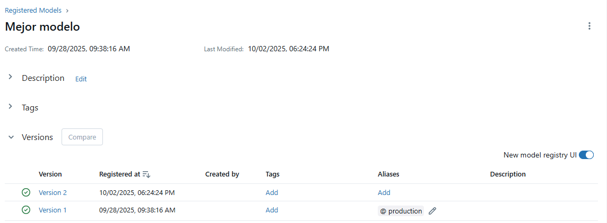

# Proyecto_Final_MLOps
Objetivo del proyecto: El proyecto se centra en el análisis y detección de transacciones fraudulentas en sistemas de dinero móvil. Usaremos el dataset PaySim1, que contiene una simulación de millones de transacciones financieras realizadas en una aplicación de pagos digitales. El objetivo principal es identificar patrones de fraude mediante el uso de técnicas de análisis de datos y machine learning.

Variables del dataset:
step: Unidad de tiempo en el modelo de simulación (cada paso equivale a 1 hora).
type: Tipo de transacción (ej: CASH-IN, CASH-OUT, DEBIT, PAYMENT, TRANSFER).
amount: Monto de la transacción.
nameOrig: Identificador del cliente que inicia la transacción.
oldbalanceOrg: Balance de la cuenta de origen antes de la transacción.
newbalanceOrig: Balance de la cuenta de origen después de la transacción.
nameDest: Identificador del cliente que recibe la transacción.
oldbalanceDest: Balance de la cuenta destino antes de la transacción.
newbalanceDest: Balance de la cuenta destino después de la transacción.
isFraud: Variable objetivo, 1 si la transacción es fraudulenta, 0 en caso contrario.
isFlaggedFraud: Señal automática del sistema → 1 si el sistema marcó la transacción como sospechosa (ejemplo: transferencias superiores a 200,000).

Alcance del ETL:
Durante el proceso de Extracción, Transformación y Carga, se realizó lo siguiente:
Se tomó una muestra representativa de 100,000 registros, dado que la base original contenía aproximadamente 6 millones de transacciones, con el fin de optimizar los tiempos de procesamiento.
Se verificó la ausencia de valores nulos en las variables del conjunto de datos.
Se eliminaron las variables nameOrig, nameDest y isFlaggedFraud, por no aportar información relevante al modelo de predicción o por representar posibles identificadores directos de las contrapartes.

Alcance del Feature_engineer:
1. Coherencia en el balance del origen
df['diff_old_new_orig'] = df['oldbalanceOrg'] - df['newbalanceOrig']
En una transacción no fraudulenta el balance anterior debe ser muy parecido al nuevo balance
Si hay un desbalance grande, puede significar:
o	Manipulación de los saldos.
o	Intento de ocultar movimientos.
o	Errores que son típicos de transacciones fraudulentas.

2. Coherencia en el balance del destino
df['diff_old_new_dest'] = df['oldbalanceDest'] - df['newbalanceDest']
En una transacción no fraudulenta el nuevo balance de la cuenta de destino debe ser muy parecido al anterior balance de la cuenta de destino
Si el valor no coincide con lo esperado, indica:
o	Que el dinero “no llegó” al destino.
o	Que se registró un valor falso en los balances.
o	Esto es típico en simulaciones de fraude como “money laundering” o “fake accounts”.

3. amount_to_orig_balance
df['amount_to_orig_balance'] = df['amount'] / (df['oldbalanceOrg'] + 1)
Mide qué tan grande es la transacción en comparación con el saldo inicial del cliente origen
o	Si el valor está cerca de 0, el cliente transfiere una fracción pequeña de su saldo, lo que es normal.
o	Si el valor está cerca de 1, el cliente transfiere prácticamente todo su saldo, lo que es inusual, posible alerta.
o	Si el valor es > 1, la transacción es mayor al saldo disponible, lo que es incoherente y sugiere un posible fraude.

4. amount_to_dest_balance
df['amount_to_dest_balance'] = df['amount'] / (df['oldbalanceDest'] + 1)
Mide cuánto representa la transacción en relación al saldo que tenía inicialmente el cliente destino
o	Si el valor es bajo, el monto recibido es pequeño en comparación al saldo existente.
o	Si el valor es alto, significa que el dinero recibido es mucho mayor que el saldo que tenía antes, lo que puede ser una cuenta utilizada para recibir y transferir dinero obtenido ilicitamente.

MLFLOW: Se corrieron 3 tipos de modelos 

1. Logistic Regression

2. XGBOOST

3. Optuna

Mejor modelo:
El mejor modelo obtenido fue el del experimento fraude-optuna (RandomForest), con un F1-score promedio de 0.92 y precisión de 1.00.
Aunque la regresión logística tuvo métricas similares, mostró signos de sobreajuste.
El modelo basado en árboles permite manejar mejor la no linealidad y la importancia de variables, reduciendo el riesgo de sobreajuste, por esto ofrece una mejor capacidad de generalización para detectar transacciones fraudulentas.

Implementación en producción:
El modelo fue preparado para ejecutarse tanto en modo batch como en modo online